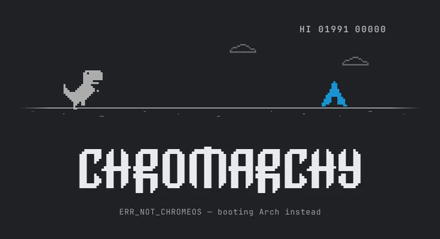
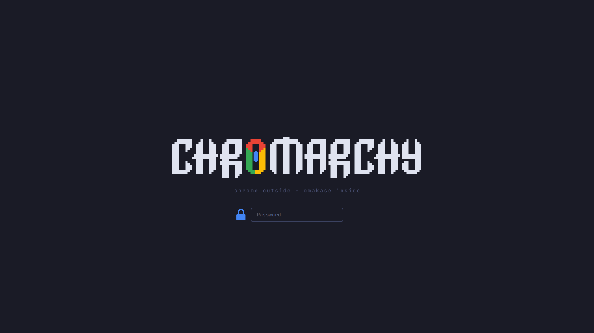
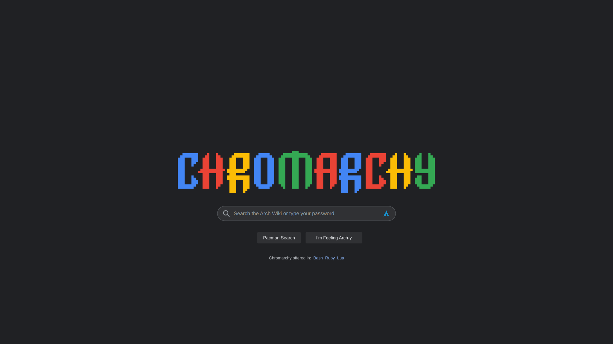
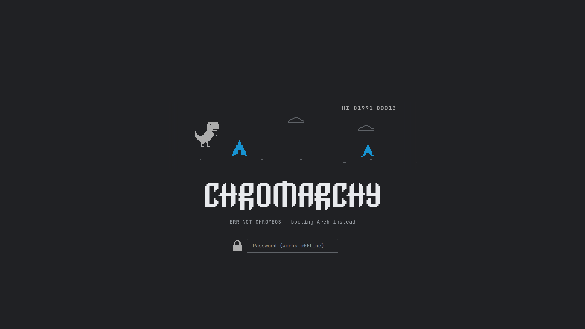
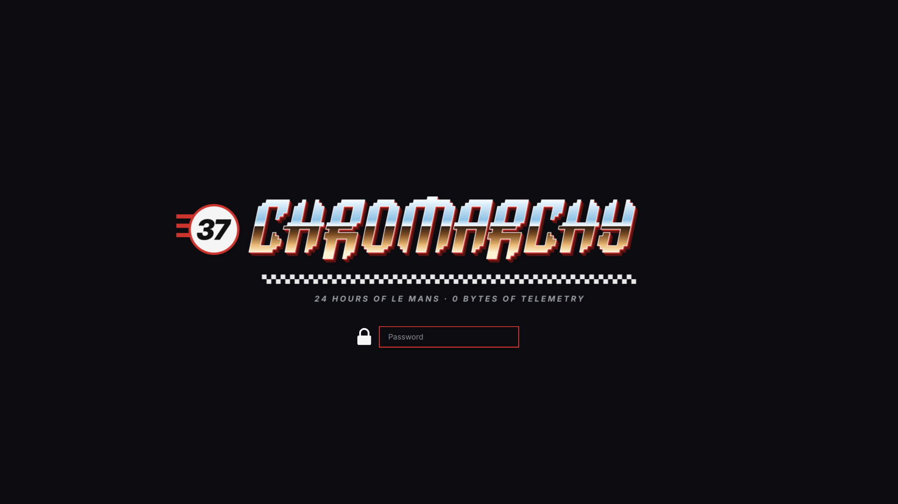
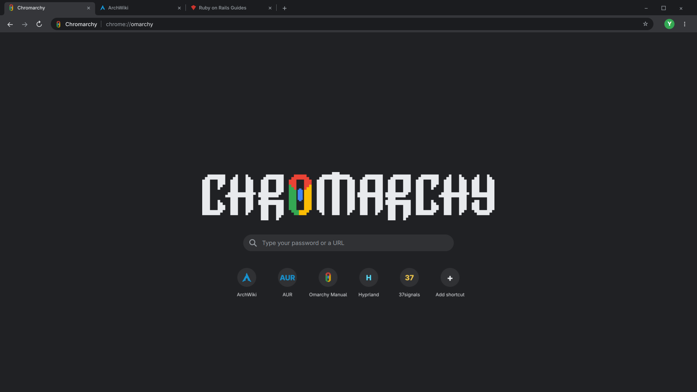

# Chromarchy Login Screen

My laptop is a Chromebook, but it doesn't run ChromeOS. I wiped it and installed [Omarchy](https://omarchy.org), DHH's Arch Linux + Hyprland setup. Chromebook + Omarchy = **Chromarchy**, and this is its lock screen.

It's a replacement for Omarchy's lock screen with five designs that mix Chrome and Google jokes with Arch, Linux and DHH references. Each time you lock, it picks one at random. Every design uses the actual Omarchy logo lettering, re-spelled as CHROMARCHY.



## The five designs

**1. Chrome-plated Omakase.** "Chromarchy" is just "Chr" + "omarchy", so the O becomes a pixel Chrome logo. The tagline: *chrome outside · omakase inside*. Chromebook hardware outside, DHH's omakase (chef's choice) software inside.



**2. I'm Feeling Arch-y.** Google's homepage, where the search box is your password box. An Arch logo sits where the microphone would be, the buttons say *Pacman Search* and *I'm Feeling Arch-y*, and "Chromarchy offered in: Bash Ruby Lua" covers Omarchy's scripts, DHH's language and Hyprland's config. A wrong password gets *Did you mean: your actual password?*



**3. ERR_NOT_CHROMEOS.** Chrome's offline dinosaur, running and jumping over Arch-logo cacti while you type. The high score is 01991, the year Linux was born. A wrong password gets `ERR_WRONG_PASSWORD`.



**4. Le Mans Livery.** DHH races at Le Mans, so the lettering gets an 80s chrome finish with a Ruby-red 3D edge, a #37 roundel for 37signals, and the tagline *24 hours of Le Mans · 0 bytes of telemetry*.



**5. chrome://omarchy.** The whole screen is a Chrome New Tab page, with tabs for ArchWiki and the Rails guides, the address bar at `chrome://omarchy`, and shortcut tiles for the AUR, Hyprland and 37signals. The profile avatar shows your own initial.



## Install

```sh
omarchy plugin add https://github.com/yfarkash/chromarchy-login-screen --enable
omarchy plugin disable omarchy.lock
omarchy restart shell
```

You need the last two lines: Omarchy's built-in lock keeps handling locks until it's disabled and the shell restarts.

Try it without locking:

```sh
omarchy-shell lock preview
```

Click to close the preview. Each preview shows the next design. Then lock for real with <kbd>Super</kbd>+<kbd>Ctrl</kbd>+<kbd>L</kbd>.

## Uninstall

```sh
omarchy plugin remove io.github.yfarkash.chromarchy-login-screen --yes
omarchy plugin enable omarchy.lock
omarchy restart shell
```

## How it works

This is a copy of Omarchy's own lock plugin (`omarchy.lock`) with a new look:

- `Service.qml` is Omarchy's lock logic (locking, password and fingerprint checks), unchanged.
- `LockView.qml` is Omarchy's lock view. I swapped the blurred wallpaper for the Chromarchy scene and restyled the password box. Typing, unlocking and failed attempts work the same as stock.
- `ChromarchyScene.qml` draws the designs and runs the dino.
- `assets/` holds the artwork, rendered by `src/build.py`. Run `src/update-assets.sh` after changing it, and `src/simulate.py` to check that the dino still clears every cactus.

To show only some designs, edit the `rotation` list near the top of `LockView.qml`.

## Good to know

- **Built for Omarchy 4.0.4.** Because this plugin carries a copy of Omarchy's lock logic, it won't pick up later Omarchy changes to the lock screen. If an Omarchy update changes the lock, this plugin may need an update too.
- **Designed for 16:9 screens** and tested at 1920×1080. It scales to other sizes.
- **If a lock ever won't accept your password,** switch to a text console with <kbd>Ctrl</kbd>+<kbd>Alt</kbd>+<kbd>F3</kbd>, log in, and run the uninstall commands above.

## Credits

- The CHROMARCHY lettering is built from the [Omarchy](https://github.com/basecamp/omarchy) logo (MIT), and the lock logic is Omarchy's.
- This is a fan project. It isn't affiliated with or endorsed by Google, Arch Linux, 37signals or Omarchy. Chrome and Google are trademarks of Google LLC, and the Arch Linux logo is a trademark of Arch Linux. All artwork here is original pixel art that only nods to them.

MIT licensed. See [LICENSE](LICENSE).
